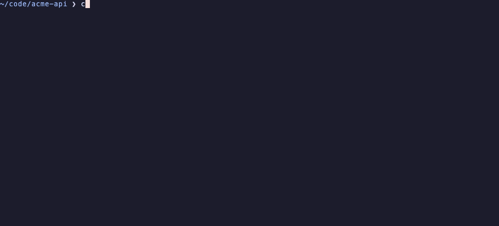

# codex-resume

Continue your OpenAI Codex chats in Claude Code. Every Codex chat (Desktop app or CLI) becomes a native Claude Code session that opens with `claude --resume` in the folder where the chat ran.

[](LICENSE)
[](https://github.com/ostiums/codex-resume/releases)




## Install

```sh
curl -fsSL https://raw.githubusercontent.com/ostiums/codex-resume/main/install.sh | zsh
```

After that, every Codex chat is listed in Claude Code's own `/resume` picker as `Codex: <title>`, and `codex-resume` in any project folder shows the Codex chats that ran there.

Requirements: macOS or Linux with zsh, `git`, `python3` 3.9 or newer, Codex and Claude Code. No other dependencies; `fzf` is installed through Homebrew when brew is present.

## What gets carried over

- Your messages and the Codex replies, in order, including everything before a Codex context compaction.
- Tool calls as short text blocks (`[Codex tool: exec]`, the command, then the output cut to 2,000 characters), so Claude knows what was run without a multi-megabyte context.
- Screenshots you attached in Codex, as real images Claude can see.
- The chat title, shown in `/resume` as `Codex: <title>`.

Left out: Codex system prompts, `<environment_context>` and AGENTS.md inserts, developer messages, encrypted reasoning, and the internal approval-reviewer sessions Codex Desktop creates. Codex data is only read, never modified.

## Compared with other tools

Measured on 2026-09-23 with one real Codex Desktop 0.155 chat: 113 tool calls, one context compaction, 43 assistant replies.

| Tool | What Claude gets | History carried | Codex system text in the history | Title in `/resume` |
|---|---|---|---|---|
| **codex-resume** | native session | all 43 replies, tool calls as compact text: 189k characters | filtered out | `Codex: <title>` |
| [transession](https://github.com/inmzhang/transession) 0.2.0 | native session | all replies with full tool output and images: 2.6M characters, about 180k tokens on the first prompt | kept, replayed as user messages | first message, which is Codex system text |
| [codex2claude](https://github.com/MisterBrookT/codex2claude) | native session (runs transession, then cleans up) | full history, 5.8 MB session file | partly filtered | first message |
| [cli-continues](https://github.com/yigitkonur/cli-continues) 4.1.1 | a summary prompt in a new session | last 10 messages (50 with `--preset full`); replies from before the compaction are lost in the default preset | partly filtered | none |
| [authsec-bridge](https://github.com/authsec-ai/authsec-bridge) | native session | replies kept, 0 of 113 tool calls | kept | none |

Where the others do more: cli-continues moves sessions between 16 coding agents, and transession converts in both directions and keeps complete tool output.

## Usage

```sh
codex-resume                     # Codex chats from the CURRENT folder: pick one in fzf and open it in Claude
codex-resume global              # same, across all folders (-g / --global is a synonym)
codex-resume resume <id>         # open a specific chat (looked up across all folders)
codex-resume list [-g] [--json]  # list chats: folder, title; current folder only by default
codex-resume import <id>         # convert only, print the command to continue
codex-resume preview <id>        # show the beginning of a chat
codex-resume sync                # import all new/changed chats so they appear in /resume
codex-resume autosync on|off     # run sync in the background at every Claude start
```

`<id>` is a full Codex session id or any unique part of it (6+ characters).

The chat always opens in Claude in the folder where it last ran in Codex (the
latest `turn_context`, falling back to where it started), even if
`codex-resume global` was started somewhere else. Folders are compared after
resolving symlinks.

In the current-folder list you see the date and the chat title; in `global`
mode the folder name is shown between them (`~` for your home folder). The
preview is hidden; **Space** shows and hides it. Because of that you can't type
a space in the fzf search field, so search by a single word. The full path is
shown in the preview.

Inside Claude Code: `/codex-import` syncs all chats. Then pick one in the
built-in `/resume` picker: type `Codex` to filter (imported chats are titled
`Codex: <title>`), `Ctrl+A` shows chats from all folders, `Space` previews,
`Enter` opens.

## Conversion limits

- Tool call input is cut to 1,000 characters and output to 2,000.
- A single message is cut to 8,000 characters. If the whole history is longer than 400,000 characters, the oldest turns are dropped and a note at the start of the chat says how many.
- Attached images (PNG, JPEG, GIF, WebP up to 5 MB) cost roughly 1 to 1.5k tokens each per request. Screenshots taken by Codex tools are not embedded; the tool output shows `[screenshot]` instead.
- The first message starts with a note that the chat was moved from Codex, so Claude treats the `[Codex tool: …]` blocks as the Codex agent's actions.
- `↩Claude` in the list marks chats that Codex itself once imported from Claude.

## Installer details

The installer:
- clones the repo into `~/.local/share/codex-resume` and links `~/.local/bin/codex-resume`;
- copies the `/codex-import` slash command to `~/.claude/commands/`;
- turns on autosync: an async `SessionStart` hook in `~/.claude/settings.json` runs `codex-resume sync --quiet` at every Claude start. It never delays startup; a sync with nothing new takes about 0.04 s with 150+ chats;
- runs the first sync, so chats are in `/resume` right away;
- installs `fzf` through Homebrew if brew is available (without fzf, chats are picked from a numbered list);
- adds `~/.local/bin` to PATH in `~/.zshrc` if it isn't there yet.

Install without autosync: `curl -fsSL …/install.sh | zsh -s -- --no-autosync`. Switch it later with `codex-resume autosync on|off`; updates never turn it back on.

Update: `codex-resume update`, or run the curl line again.

## Re-importing

The Claude session id is derived from the Codex session id, so re-importing
updates the same file. If the imported session has already been continued in
Claude (the file has grown), it is left untouched: a new session is created and
a warning is printed. `sync` only re-imports a chat when its Codex file has
changed since the last import, so continuing a chat in Claude never produces
duplicates by itself. State is kept in `~/.local/state/codex-resume/imports.json`.

## Uninstall

```sh
codex-resume autosync off
rm ~/.local/bin/codex-resume ~/.claude/commands/codex-import.md
rm -rf ~/.local/state/codex-resume ~/.local/share/codex-resume
```

## Tests

```sh
python3 -m unittest discover -s tests
```

## License

MIT. See [LICENSE](LICENSE).
